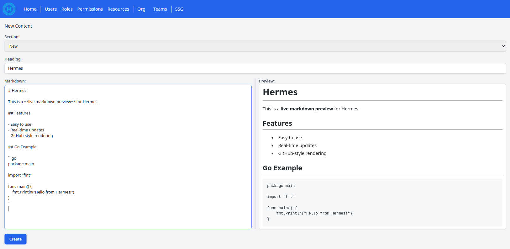

# Hermes

Hermes is a static site generator (SSG) written in Go.

It aims to provide a clean, fast, and flexible way to build static websites. While still early in development, Hermes is designed for simplicity and will evolve with new features as the project grows.

## Notes

Although Hermes provides a web interface, it is fundamentally a static site generator (SSG). All content is managed locally (or in the cloud if the service runs on a remote server), and the output is pure HTML, suitable for hosting on platforms like GitHub Pages. Hermes will handle publishing both manually and automatically. Additionally, you can continue to write your markdown content using a text editor if that workflow is more natural or practical for you, rather than using the web interface.

Hermes implements an authentication and authorization system with support for multiple users and teams. However, the initial implementation is designed for single-user operation on a personal machine (localhost). Multi-user support will be optimized in future iterations.

All authentication features should work, but since the SSG feature shares some logic with authorization and is being iteratively improved to create a simple API, some changes may impact authentication-related functionality. Please keep this in mind as the system evolves.
